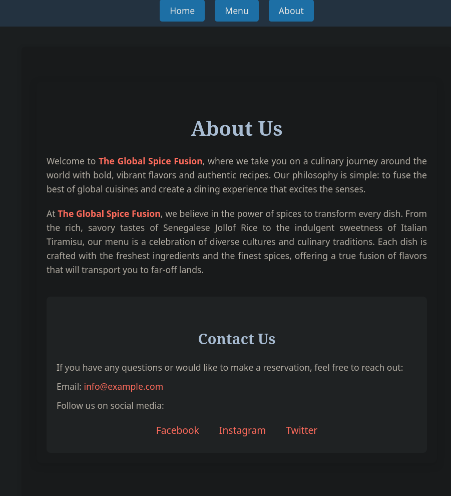

# Restaurant Page

The page features a simple tabbed navigation to switch between different sections like "Home," "Menu," and "Contact." The entire page structure is generated using JavaScript, with styling managed in a separate CSS file.

## Preview
View the live demo here: [Restaurant Page Live Preview](https://mx-99.github.io/odin_restaurant_page/).


 

## Features

- **Dynamic Content Generation**
- **Tab Navigation**


## Setup Instructions

### Prerequisites

- **Node.js**: Make sure you have Node.js installed. You can download it from [here](https://nodejs.org/).
- **Git**: Ensure Git is installed for version control. Download from [here](https://git-scm.com/).

### Installing and Running the Project

1. **Clone the repository**:
   ```bash
   git clone https://github.com/mx-99/my_odin_projects/
   cd my_odin_projects/full_stack/restaurent_page
   ```

2. **Install dependencies**:
   Install the necessary packages using npm.
   ```bash
   npm install
   ```

3. **Start the development server**:
   Run the Webpack development server to see the project live on your local machine.
   ```bash
   npx webpack serve
   ```
   You can view the project by navigating to [http://localhost:8080](http://localhost:8080).

