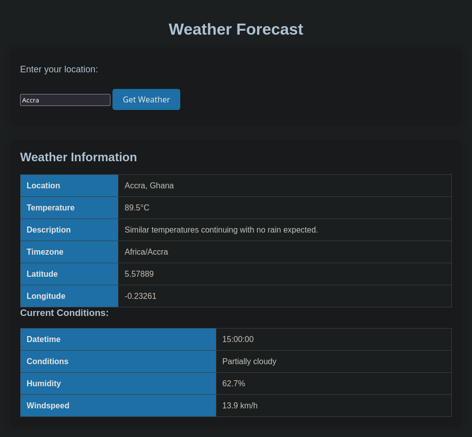

# Weather Forecast App

A simple web apage that provides weather information based on user input. The app fetches weather data from an API and displays the current conditions, temperature, humidity, wind speed, and more for the specified location.

## Features
- Search weather for any city or use a random city.
- Displays key weather information such as temperature, humidity, wind speed, and more.
- Includes error handling for failed API requests and empty inputs.

## Demo
Live preview
[Weather Forecast App Demo](https://mx-99.github.io/weather_app/dist/) 

## Screenshot


## Installation

To run this project locally, follow these steps:

1. Clone the repository:

   ```bash
   git clone https://github.com/mx-99/my_odin_projects/tree/main/full_stack/weather_app
   ```

2. Navigate into the project directory:

   ```bash
   cd weather_-forecast-_app
   ```

3. Install dependencies:

   ```bash
   npm install
   ```

4. Start the development server:

   ```bash
   npm run dev
   ```

5. Open the app in your browser:

   Visit `http://localhost:8080` to view the app.

## Technologies Used
- **JavaScript** (ES6+)
- **Webpack** for bundling the app
- **CSS** for styling
- **Visual Crossing Weather API** to fetch weather data


## Acknowledgements
- The Weather API is provided by [Visual Crossing](https://www.visualcrossing.com/).
